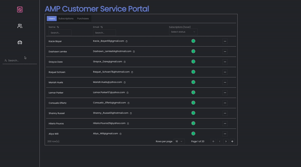
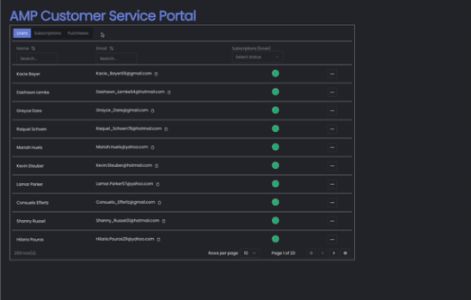

  

<h3 align="center">AMP Customer Service Portal</h3>
  

  A streamlined customer service portal for managing car wash memberships.
     
    <a href="https://amp.husekivrak.com">View Demo</a>
    ·
    <a href="https://github.com/husekivrak/car-wash-portal/issues/new?labels=bug&template=bug-report---.md">Report Bug</a>
    ·
    <a href="https://github.com/husekivrak/car-wash-portal/issues/new?labels=enhancement&template=feature-request---.md">Request Feature</a>
  

<!-- TABLE OF CONTENTS -->

  
Table of Contents

  <ol>
    <li>
      <a href="#about-the-project">About</a>
      <ul>
        <li><a href="#built-with">Built With</a></li>
      </ul>
    </li>
    <li>
      <a href="#getting-started">Getting Started</a>
    </li>
   <li>
      <a href="#features">Features</a>
      <ul>
        <li><a href="#user-interface">User Interface</a></li>
        <li><a href="#data-tables">Data Tables</a></li>
      </ul>
    </li>
    <li><a href="#license">License</a></li>
    <li><a href="#contact">Contact</a></li>
  </ol>

## About

[![Portal Screenshot][portal-screenshot]](https://amp.husekivrak.com)

  This project was my response to a prompt solicited by a mentor: create a front-end customer service portal for a car wash membership platform within a one-week development timeline.

  It's built with `TypeScript` and `Next.js`, with `Vercel` as the deployment platform. For a more complete experience, I also added backend functionalites using a `PostgreSQL` database hosted on `Supabase` and managed with `Drizzle`.

  Development was a fun process that allowed opportunities to both explore new libraries (e.g., `TanStack Tables` and `Faker.js`) and dive deeper into familiar ones, like `Drizzle`'s relational query builder and prepared statements.

  Building the [nested form modals](#user-interface) was particularly challenging, as it required synchronizing the parent form's options based on its child form's submission and proper modal handling. Integrating server actions and toast notifications with these functionalities provided valuable lessons in state management and component hierarchy.

  Despite the limited development timeframe, this project is a work in progress that I hope to revist soon.  If you come across any bugs, kindly <a href="https://github.com/husekivrak/car-wash-portal/issues/new?labels=bug&template=bug-report---.md">report them here</a>. Thanks!

(<a href="#readme-top">back to top</a>)

### Built With

* [![React][React.js]][React-url]
* [![Next][Next.js]][Next-url]
* [![TypeScript][TypeScript]][TypeScript-url]
* [![Tailwind CSS][Tailwind CSS]][Tailwind-url]
* [![Shadcn][Shadcn]][Shadcn-url]
* [![react-hook-form][react-hook-form]][react-hook-form-url]
* [![Zod][Zod]][Zod-url]
* [![Drizzle][Drizzle]][Drizzle-url]
* [![Postgres][Postgres]][Postgres-url]
* [![Supabase][Supabase]][Supabase-url]
* [![Vercel][Vercel]][Vercel-url]

See [package.json](https://github.com/husekivrak/car-wash-portal/blob/main/package.json) for a full list of dependencies.

(<a href="#readme-top">back to top</a>)

## Getting Started
**Coming soon**

Detailed setup instructions will be added soon. In the meantime, feel free to reach out if you have any questions.

(<a href="#readme-top">back to top</a>)

## Features

### User Interface

The UI design centers around user actions, prioritizing quick access and intuitive workflows for efficient customer support.

- **Form modals**: Simplified workflows utilizing nested modal dialogs for multi-step processes, with validation and notifications for a user-friendly and error-free experience.
- **Sidebar Search**: Provides instant access to user details with an autocomplete search bar that dynamically updates as you type.
- **Toast Notifications**: Immediate feedback on user actions to ensure responsive and efficient operations.

---

### Data Tables

This project uses data tables from `shadcn/ui`, built on and further customized with the [TanStack Tables](https://tanstack.com/table/latest) library to provide an intuitive and user-friendly interface.

- **Status Indicators**: View account statuses at a glance with color-coded chips and hover to reveal additional details.
- **Search and Sort**: Quick data access through column-specific search and sort functionalities.
- **Pagination**: Dynamic pagination with customizable page sizes for easy page nativation.
- **Row-Level Actions**: Features like copy-to-clipboard for emails and an expanded action menu for streamlined user management.
- **Dynamic Data Loading**: Real-time data updates during filtering and CRUD operations to reflect the most current information without a page refresh.

(<a href="#readme-top">back to top</a>)

## License

Distrubuted under the MIT License. See [LICENSE.txt](https://github.com/husekivrak/car-wash-portal/blob/main/LICENSE.txt) for more information.

## Contact

Huse Kivrak - huse@husekivrak.com

Live Demo: [AMP Customer Service Portal](https://amp.husekivrak.com)

Project Link: [https://github.com/husekivrak/car-wash-portal](https://github.com/husekivrak/car-wash-portal)

[portal-screenshot]: public/portal_screenshot.png
[Next.js]: https://img.shields.io/badge/next.js-000000?logo=nextdotjs&logoColor=white&style=for-the-badge
[Next-url]: https://nextjs.org/
[React.js]: https://img.shields.io/badge/React-20232A?logo=react&logoColor=61DAFB&style=for-the-badge
[React-url]: https://reactjs.org/
[Supabase]: https://img.shields.io/badge/Supabase-37996B?logo=supabase&logoColor=white&style=for-the-badge
[Supabase-url]: https://supabase.com/
[Vercel]: https://img.shields.io/badge/Vercel-000000?logo=vercel&style=for-the-badge
[Vercel-url]: https://vercel.com/
[Drizzle]: https://img.shields.io/badge/Drizzle-000000?logo=drizzle&style=for-the-badge
[Drizzle-url]: https://drizzle.com/
[Shadcn]: https://img.shields.io/badge/shadcn%2Fui-000000?logo=shadcnui&style=for-the-badge
[Shadcn-url]: https://ui.shadcn.com/
[Tailwind CSS]: https://img.shields.io/badge/Tailwind_CSS-38B2AC?logo=tailwind-css&logoColor=white&style=for-the-badge
[Tailwind-url]: https://tailwindcss.com/
[Postgres]: https://img.shields.io/badge/PostgreSQL-316192?logo=postgresql&logoColor=white&style=for-the-badge
[Postgres-url]: https://www.postgresql.org/
[react-hook-form]: https://img.shields.io/badge/REACT_HOOK_FORM-ec5990?logo=reacthookform&logoColor=white&style=for-the-badge
[react-hook-form-url]: https://react-hook-form.com/
[Zod]: https://img.shields.io/badge/Zod-000000?logo=zod&logoColor=3e67b1&style=for-the-badge
[Zod-url]:https://zod.dev/
[TypeScript]:
  https://img.shields.io/badge/TypeScript-007ACC?logo=typescript&logoColor=white&style=for-the-badge
[TypeScript-url]: https://www.typescriptlang.org/